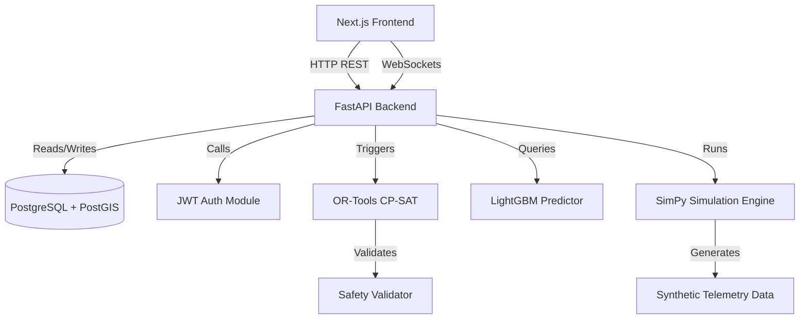

# Architecture Decisions & Specification

## D. Dependency Graph


## E. Recommended Repository Structure
```text
/
├── backend/                  # FastAPI Application
│   ├── app/
│   │   ├── api/              # Route definitions
│   │   ├── core/             # Config, Auth, Security
│   │   ├── db/               # DB connection & migrations (Alembic)
│   │   ├── models/           # SQLAlchemy ORM Models
│   │   ├── schemas/          # Pydantic Schemas
│   │   ├── ml/               # Scikit-learn/LightGBM models & inference
│   │   ├── optimization/     # OR-Tools logic
│   │   ├── simulation/       # SimPy environment & models
│   │   ├── services/         # Business logic
│   │   └── main.py
│   ├── pyproject.toml        # Dependencies (Poetry or Pip)
│   └── Dockerfile
├── frontend/                 # Next.js Application
│   ├── src/
│   │   ├── app/              # Next.js App Router pages
│   │   ├── components/       # React components (Map, Charts, UI)
│   │   ├── lib/              # API clients, utilities
│   │   └── store/            # State management
│   ├── package.json
│   └── Dockerfile
├── data/                     # Synthetic data generator & seed files
├── docker-compose.yml        # Local infrastructure
└── README.md
```

## F. Required Shared Data Contracts
These definitions act as Pydantic models on the backend and TypeScript interfaces on the frontend.
1. **User Token**: `{ access_token: str, role: RoleEnum }`
2. **MaintenanceRequest**: `{ id: uuid, dept: str, asset_id: uuid, location: GeoJSON, duration_mins: int, priority_score: float, status: str }`
3. **BlockWindow**: `{ id: uuid, start_time: datetime, end_time: datetime, affected_corridor: GeoJSON, assigned_requests: list[uuid] }`
4. **SimulationEvent**: `{ timestamp: datetime, type: str, message: str, coordinates: list[float] }`

## G. Required Database Entities
- **User**: Authentication credentials and Role (Controller, Maintenance, Ops, Management, Crew).
- **Asset**: Railway infrastructure (tracks, signals, OHE) using PostGIS `Geometry` for location.
- **MaintenanceRequest**: User-submitted or ML-predicted maintenance jobs.
- **BlockPlan**: Generated optimization plans for block windows.
- **TrainSchedule**: Timetables to be used as constraints for block planning.

## H. Required APIs
- `POST /api/v1/auth/login` - Authenticate users.
- `GET /api/v1/assets` - Fetch digital twin assets for map rendering.
- `POST /api/v1/maintenance/requests` - Submit new maintenance requests.
- `GET /api/v1/maintenance/requests` - List requests with ML-scored priorities.
- `POST /api/v1/optimization/plan` - Trigger OR-Tools to generate a block plan.
- `POST /api/v1/simulation/what-if` - Trigger SimPy to validate a proposed plan.
- `WS /ws/v1/telemetry` - Stream real-time simulated telemetry to the frontend.

## I. Critical Technical Risks
1. **Optimization Timeout**: OR-Tools CP-SAT can run indefinitely on NP-hard scheduling problems. We must define strict time bounds and fallback heuristics.
2. **Simulation Integration**: Syncing SimPy's virtual time with FastAPI's asynchronous event loop and WebSockets.
3. **Data Fusion**: Combining relational data with GeoSpatial (PostGIS) data efficiently for frontend rendering (deck.gl).
