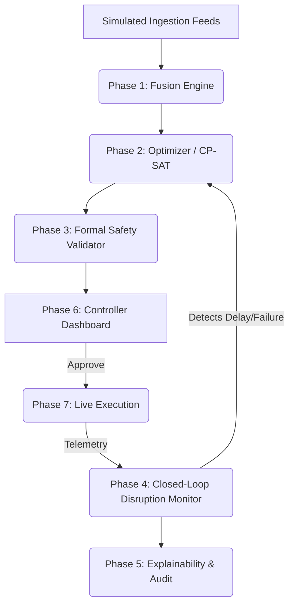

# Gatidhara — Architecture Overview

This document provides a high-level overview of the Gatidhara system architecture, designed for the Smart India Hackathon (SIH). The system resolves the "Track Maintenance vs. Train Operations" conflict through a deterministic, AI-driven closed-loop architecture.

## 1. High-Level System Architecture

## 2. Core Components

### Phase 1: Data Ingestion & Fusion
* **Module:** `backend/app/services/fusion.py`
* **Purpose:** Merges 8 simulated data streams (RBPMS, COA-FOIS, TDMS, etc.) into a "Single Source of Truth." Detects stale data, missing values, and contradictions (e.g., Crew listed as available but on leave).

### Phase 2: CP-SAT Optimization
* **Module:** `backend/app/services/optimization/adapter.py`
* **Purpose:** Translates railway scheduling into a mathematical constraint satisfaction problem using Google's OR-Tools. Maximizes track utilization while strictly respecting maintenance windows.

### Phase 3: Formal Safety Validation
* **Module:** `backend/app/services/safety/validator.py`
* **Purpose:** An independent validation layer that ensures the optimizer's output is safe. It checks:
    1. Line Clear rules (no two trains in the same section).
    2. Braking Distance rules.
    3. HOER Crew Hours (simulated limits).

### Phase 4 & 7: Simulation and Closed-Loop Execution
* **Module:** `backend/app/services/execution/closed_loop.py`
* **Purpose:** Simulates the passage of time and train movement. Ingests simulated telemetry. If a disruption occurs (e.g., block overrun, machine failure), it bounds the impact and autonomously triggers a re-optimization cycle.

### Phase 5: Explainability & Audit
* **Module:** `backend/app/services/explainability/generator.py`
* **Purpose:** Provides transparent, deterministic, natural-language explanations of *why* the AI made a decision, ensuring human controllers can trust the system.

### Phase 6: Frontend Dashboard
* **Module:** `frontend/` (Next.js / React)
* **Purpose:** The Controller UI. Visualizes the network, lists active block requests, displays the optimal plan timeline, and provides the interface for approving plans and triggering disruptions for demo purposes.

## 3. Tech Stack
* **Backend:** Python 3.11, FastAPI, SQLAlchemy
* **Solver:** Google OR-Tools (CP-SAT)
* **Frontend:** Next.js, React, TailwindCSS, Lucide React
* **Database:** SQLite (local development/unit tests) / PostgreSQL (Dockerized for integration)
